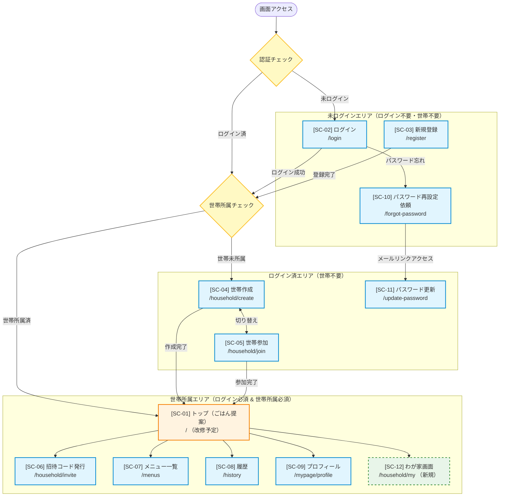

# 画面フロー図・設計仕様書 (gohan-nandemoii-v2)

本書は、`gohan-nandemoii-v2` における画面一覧、アクセス制御、画面フロー図、およびデータベース構造（ER図）を定義するドキュメントです。

---

## 1. 画面一覧

| 画面ID    | 画面名               | URL                 | ログイン | 世帯所属 | 概要                                           |   状態   |
| :-------- | :------------------- | :------------------ | :------: | :------: | :--------------------------------------------- | :------: |
| **SC-01** | トップ（ごはん提案） | `/`                 |   必須   |   必須   | 今日のごはん提案およびメインダッシュボード     | 改修予定 |
| **SC-02** | ログイン             | `/login`            |   不要   |   不要   | メール/パスワードによるログイン認証            |  実装済  |
| **SC-03** | 新規登録             | `/register`         |   不要   |   不要   | 新規ユーザーアカウント作成                     |  実装済  |
| **SC-04** | 世帯作成             | `/household/create` |   必須   |   不要   | 新しい世帯グループの立ち上げ・作成             |  実装済  |
| **SC-05** | 世帯参加             | `/household/join`   |   必須   |   不要   | 招待コードを使用した既存世帯への参加           |  実装済  |
| **SC-06** | 招待コード発行       | `/household/invite` |   必須   |   必須   | 世帯メンバー招待用のコード生成・管理           |  実装済  |
| **SC-07** | メニュー一覧         | `/menus`            |   必須   |   必須   | 登録されているレシピ・料理メニューの閲覧・管理 |  実装済  |
| **SC-08** | 履歴                 | `/history`          |   必須   |   必須   | 過去に提案・決定・食べたごはんの履歴参照       |  実装済  |
| **SC-09** | プロフィール         | `/mypage/profile`   |   必須   |   必須   | ユーザー情報・アカウント設定の変更             |  実装済  |
| **SC-10** | パスワード再設定依頼 | `/forgot-password`  |   不要   |   不要   | パスワードリセット用メールの送信リクエスト     |  実装済  |
| **SC-11** | パスワード更新       | `/update-password`  |   必須   |   不要   | パスワード変更処理画面                         |  実装済  |
| **SC-12** | わが家画面           | `/household/my`     |   必須   |   必須   | 世帯メンバーの一覧・世帯設定情報の確認画面     |   新規   |

---

## 2. アクセス制御と分岐（ガード条件）

画面へアクセスする際、認証状態および世帯所属状態に応じて以下のリダイレクト制御を行います。

### ガード条件とリダイレクト先

1. **未ログインガード（未認証の場合）**
   - **対象**: ログインが「必須」となっているすべての画面
   - **条件**: 未ログイン状態（セッション/トークンなし）でアクセス
   - **リダイレクト先**: **`SC-02 ログイン (/login)`**

2. **世帯未所属ガード（世帯が必要な場合）**
   - **対象**: 世帯所属が「必須」となっているすべての画面
   - **条件**: ログイン済だが、どの世帯にも所属していない場合
   - **リダイレクト先**: **`SC-04 世帯作成 (/household/create)`** （または `SC-05 世帯参加`）

3. **ログイン済みガード（認証済みでアクセス不可画面）**
   - **対象**: `SC-02 ログイン`, `SC-03 新規登録`
   - **条件**: 既にログイン済みのユーザーが直接アクセス
   - **リダイレクト先**: **`SC-01 トップ (/ )`** （世帯所属済） または **`SC-04 世帯作成 (/household/create)`** （世帯未所属）

---

## 3. 画面フロー図 (Flowchart)

