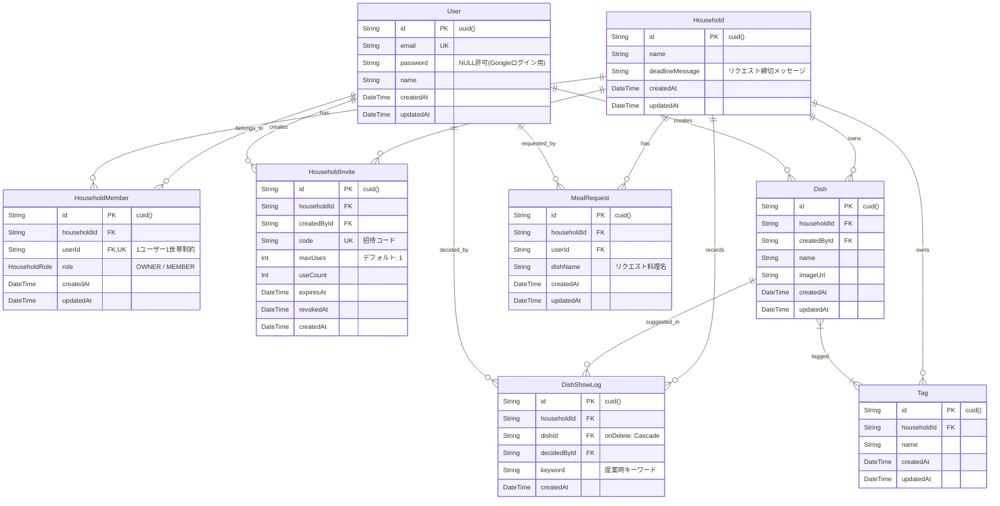

# データモデル定義書 (gohan-nandemoii-v2)

本書は、`gohan-nandemoii-v2` におけるデータベース構造（`prisma/schema.prisma` 拠拠）、ER図、テーブル定義、および制約（Key、Index、リレーション）を定義するドキュメントです。

---

## 1. ER図 (Entity Relationship Diagram)

```mermaid
erDiagram
    User ||--o{ HouseholdMember : "belongs_to"
    Household ||--o{ HouseholdMember : "has"
    Household ||--o{ HouseholdInvite : "issues"
    User ||--o{ HouseholdInvite : "creates"
    Household ||--o{ Dish : "owns"
    User ||--o{ Dish : "creates"
    Household ||--o{ DishShowLog : "records"
    Dish ||--o{ DishShowLog : "suggested_in"
    User ||--o{ DishShowLog : "decided_by"
    Household ||--o{ Tag : "owns"
    Dish }|--|{ Tag : "tagged"
    Household ||--o{ MealRequest : "has"
    User ||--o{ MealRequest : "requested_by"

    User {
        String id PK "uuid()"
        String email UK
        String password "NULL許可(Googleログイン用)"
        String name
        DateTime createdAt
        DateTime updatedAt
    }

    Household {
        String id PK "cuid()"
        String name
        String deadlineMessage "リクエスト締切メッセージ"
        DateTime createdAt
        DateTime updatedAt
    }

    HouseholdMember {
        String id PK "cuid()"
        String householdId FK
        String userId FK,UK "1ユーザー1世帯制約"
        HouseholdRole role "OWNER / MEMBER"
        DateTime createdAt
        DateTime updatedAt
    }

    HouseholdInvite {
        String id PK "cuid()"
        String householdId FK
        String createdById FK
        String code UK "招待コード"
        Int maxUses "デフォルト: 1"
        Int useCount
        DateTime expiresAt
        DateTime revokedAt
        DateTime createdAt
    }

    Dish {
        String id PK "cuid()"
        String householdId FK
        String createdById FK
        String name
        String imageUrl
        DateTime createdAt
        DateTime updatedAt
    }

    Tag {
        String id PK "cuid()"
        String householdId FK
        String name
        DateTime createdAt
        DateTime updatedAt
    }

    DishShowLog {
        String id PK "cuid()"
        String householdId FK
        String dishId FK "onDelete: Cascade"
        String decidedById FK
        String keyword "提案時キーワード"
        DateTime createdAt
    }

    MealRequest {
        String id PK "cuid()"
        String householdId FK
        String userId FK
        String dishName "リクエスト料理名"
        DateTime createdAt
        DateTime updatedAt
    }
```
