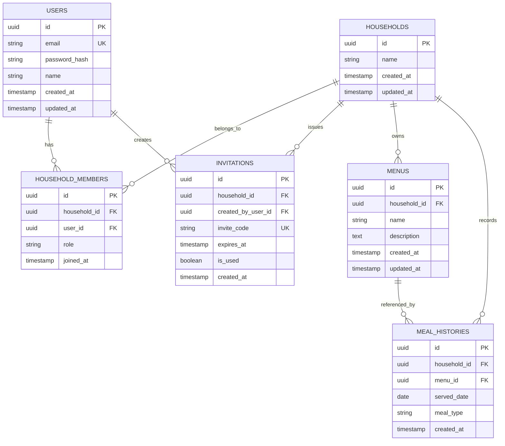

# データモデル定義書 (gohan-nandemoii-v2)

本書は、`gohan-nandemoii-v2` におけるデータベース構造、ER図、テーブル定義、および制約（Key、Index、リレーション）を定義するドキュメントです。

---

## 1. ER図 (Entity Relationship Diagram)

---

## 2. テーブル定義・制約一覧

### 2.1. `users`（ユーザー基本情報）

ユーザーのアカウント情報を管理するテーブル。

| カラム名 | 物理名 | データ型 | NULL | 物理制約 | 初期値 | 説明 |
| :--- | :--- | :--- | :---: | :--- | :--- | :--- |
| ユーザーID | `id` | UUID | ✕ | PRIMARY KEY | `gen_random_uuid()` | ユーザー識別子 |
| メールアドレス | `email` | VARCHAR(255) | ✕ | UNIQUE | - | ログイン用メールアドレス |
| パスワードハッシュ | `password_hash` | VARCHAR(255) | ✕ | - | - | ハッシュ化済みパスワード |
| ユーザー名 | `name` | VARCHAR(50) | ✕ | - | - | サービス内表示名 |
| 作成日時 | `created_at` | TIMESTAMP | ✕ | - | `CURRENT_TIMESTAMP` | 登録日時 |
| 更新日時 | `updated_at` | TIMESTAMP | ✕ | - | `CURRENT_TIMESTAMP` | 最終更新日時 |

---

### 2.2. `households`（世帯グループ）

グループ（世帯）単位の情報を管理するテーブル。

| カラム名 | 物理名 | データ型 | NULL | 物理制約 | 初期値 | 説明 |
| :--- | :--- | :--- | :---: | :--- | :--- | :--- |
| 世帯ID | `id` | UUID | ✕ | PRIMARY KEY | `gen_random_uuid()` | 世帯識別子 |
| 世帯名 | `name` | VARCHAR(50) | ✕ | - | - | 例: 「山田家」「我が家」など |
| 作成日時 | `created_at` | TIMESTAMP | ✕ | - | `CURRENT_TIMESTAMP` | グループ作成日時 |
| 更新日時 | `updated_at` | TIMESTAMP | ✕ | - | `CURRENT_TIMESTAMP` | 最終更新日時 |

---

### 2.3. `household_members`（世帯所属メンバー）

ユーザーと世帯の中間テーブル（多対多の関連付け）。

| カラム名 | 物理名 | データ型 | NULL | 物理制約 | 初期値 | 説明 |
| :--- | :--- | :--- | :---: | :--- | :--- | :--- |
| メンバーID | `id` | UUID | ✕ | PRIMARY KEY | `gen_random_uuid()` | 紐付け識別子 |
| 世帯ID | `household_id` | UUID | ✕ | FK (households.id) | - | 外部キー（CASCADE DELETE） |
| ユーザーID | `user_id` | UUID | ✕ | FK (users.id) | - | 外部キー（CASCADE DELETE） |
| 役割 | `role` | VARCHAR(20) | ✕ | CHECK | `'member'` | `owner` / `member` |
| 参加日時 | `joined_at` | TIMESTAMP | ✕ | - | `CURRENT_TIMESTAMP` | 世帯参加日時 |

* **複合ユニーク制約**: `UNIQUE(household_id, user_id)` （同一ユーザーが同一世帯に重複登録されるのを防止）

---

### 2.4. `invitations`（世帯招待コード）

家族・パートナーを招待するためのコード管理テーブル。

| カラム名 | 物理名 | データ型 | NULL | 物理制約 | 初期値 | 説明 |
| :--- | :--- | :--- | :---: | :--- | :--- | :--- |
| 招待ID | `id` | UUID | ✕ | PRIMARY KEY | `gen_random_uuid()` | 招待識別子 |
| 世帯ID | `household_id` | UUID | ✕ | FK (households.id) | - | 招待先の世帯ID |
| 作成者ユーザーID | `created_by_user_id` | UUID | ✕ | FK (users.id) | - | コードを発行したユーザーID |
| 招待コード | `invite_code` | VARCHAR(32) | ✕ | UNIQUE | - | 英数字による招待コード |
| 有効期限 | `expires_at` | TIMESTAMP | ✕ | - | - | コードの有効期限（例: 発行から24時間） |
| 使用済フラグ | `is_used` | BOOLEAN | ✕ | - | `false` | 使用済みかどうか |
| 作成日時 | `created_at` | TIMESTAMP | ✕ | - | `CURRENT_TIMESTAMP` | 発行日時 |

---

### 2.5. `menus`（料理メニュー）

世帯ごとに登録・管理する料理レシピ情報。

| カラム名 | 物理名 | データ型 | NULL | 物理制約 | 初期値 | 説明 |
| :--- | :--- | :--- | :---: | :--- | :--- | :--- |
| メニューID | `id` | UUID | ✕ | PRIMARY KEY | `gen_random_uuid()` | メニュー識別子 |
| 世帯ID | `household_id` | UUID | ✕ | FK (households.id) | - | 所属する世帯ID |
| 料理名 | `name` | VARCHAR(100) | ✕ | - | - | 料理名（例: カレーライス） |
| 詳細メモ | `description` | TEXT | ○ | - | NULL | レシピURLや作り方のメモ |
| 作成日時 | `created_at` | TIMESTAMP | ✕ | - | `CURRENT_TIMESTAMP` | 登録日時 |
| 更新日時 | `updated_at` | TIMESTAMP | ✕ | - | `CURRENT_TIMESTAMP` | 最終更新日時 |

---

### 2.6. `meal_histories`（食事履歴）

実際に食べたごはんの履歴記録テーブル。

| カラム名 | 物理名 | データ型 | NULL | 物理制約 | 初期値 | 説明 |
| :--- | :--- | :--- | :---: | :--- | :--- | :--- |
| 履歴ID | `id` | UUID | ✕ | PRIMARY KEY | `gen_random_uuid()` | 履歴識別子 |
| 世帯ID | `household_id` | UUID | ✕ | FK (households.id) | - | 所属する世帯ID |
| メニューID | `menu_id` | UUID | ○ | FK (menus.id) | NULL | 食べたメニューの参照ID |
| 食べた日付 | `served_date` | DATE | ✕ | - | - | 食べた年月日 |
| 食事区分 | `meal_type` | VARCHAR(20) | ✕ | CHECK | `'dinner'` | `breakfast` / `lunch` / `dinner` |
| 記録日時 | `created_at` | TIMESTAMP | ✕ | - | `CURRENT_TIMESTAMP` | データ登録日時 |

---

## 3. インデックス設計・制約ルール

### 3.1. 主要インデックス

検索パフォーマンス向上のため、以下のカラムにインデックスを設定します。

1. **`household_members(user_id)`**
   * ログイン時に「ユーザーがどの世帯に属しているか」を高速取得するため。
2. **`menus(household_id)`**
   * 「今日の提案」や「メニュー一覧」表示時、世帯ごとのメニューを高速取得するため。
3. **`meal_histories(household_id, served_date)`**
   * 履歴一覧・カレンダー表示および提案ロジックでの直近履歴検索用。

### 3.2. 外部キー削除ポリシー (ON DELETE)

* **世帯削除時 (`households`)**: 関連する `household_members`, `invitations`, `menus`, `meal_histories` を CASCADE 削除。
* **メニュー削除時 (`menus`)**: 過去の食事履歴を残すため、`meal_histories.menu_id` は **SET NULL** とし、履歴データ自体は保持する。